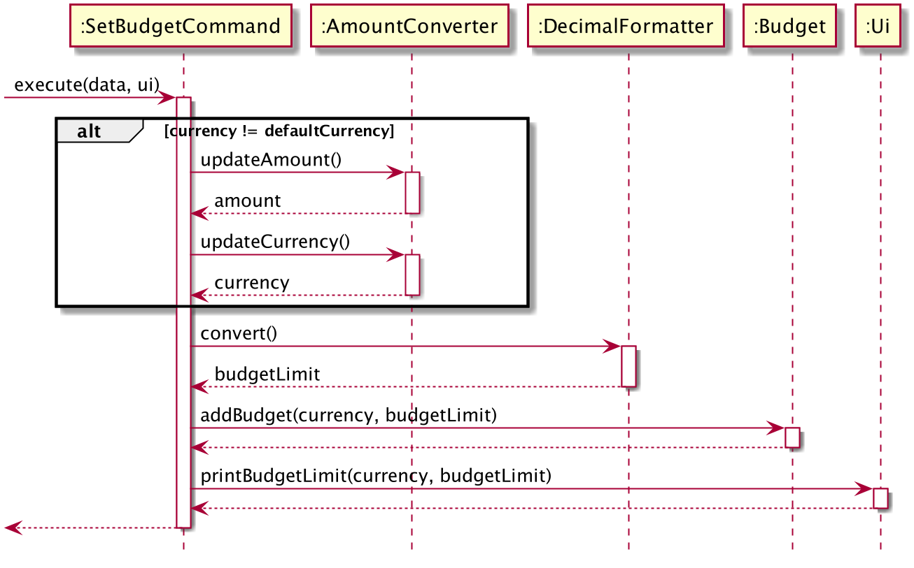
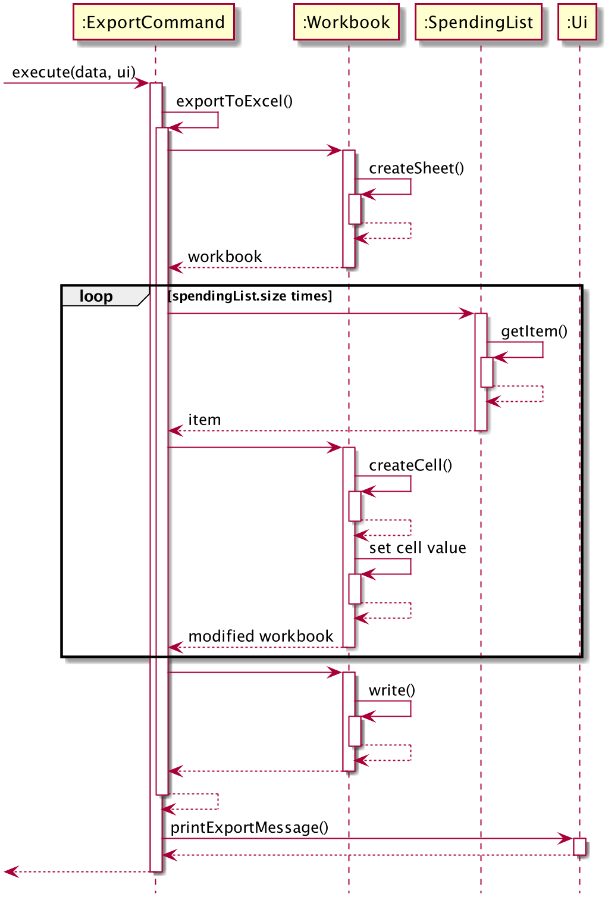

# Developer Guide

## Introduction
Cent Wise Dollar Wise is a desktop application for money management, optimised for use via a Command Line Interface (CLI). This application aims to help NUS hostel students manage their financial situation and track their spending efficiently. 
This developer guide provides information on the architecture and design of the application. It will not only help you get started as a Cent Wise Dollar Wise contributer, but that you will find useful to refer to even if you are already a contributer of this project. 

## Design & implementation
### Edit Feature
`SpendingList` and `Ui` facilitate this feature. The Edit feature is able to edit the existing items in the spending list. 
It implements the following operations:
* `SpendingList#editItemDescription(index, description)` → updates the description of the item in the spending list
* `SpendingList#editItemCategory(index, description)` → updates the category of the item in the spending list
* `SpendingList#editItemAmount(index, amount)` → updates the amount of the item in the spending list
* `Ui#printEdit(spendingList, index)` → prints the message to show the successful completion of the edition process

Below shows an example of the usage:
1. User executes `edit 1 bubble tea` command to edit the first item in the spending list to bubble tea 
2. The `edit` command calls the `EditCommand#execute(spendingList, ui)` to complete the edition process

Figure below shows the sequence diagram of `EditCommand` class.

### Convert Feature
`SpendingList`, `Ui` and `Item` facilitate this feature. The Convert feature is able to convert the currency of the items 
stored in the spending list. It implements the following operations:
* `SpendingList#getSpendingList()` → retrieves the current spending list
* `ConvertCommand#identifyCurrency(description)` → identifies the currency after conversion
* `ConvertCommand#findExchangeRate()` → finds the corresponding exchange rate
* `Item#editAmount(amount)` → updates the new amount after conversion
* `Item#editSymbol(currency)` → updates the new currency after conversion
* `SpendingList#updateSpendingList()` → updates the spending list after conversion 
* `Ui#printConvertCurrency(outputCurrency)` → prints the message to show the successful completion of the conversion 
process

Below shows an example of the usage:
1. User executes `convert SGD USD` command to convert the currency from SGD to USD
2. The `convert` command calls the `ConvertCommand#execute(spendingList, ui)` to complete the conversion process

Figure below shows the sequence diagram of `ConvertCommand` class.

### Set Budget Feature
`Budget` and `Ui` facilitate this feature. The Set Budget feature is able to set the budget limit for the spending. 
It implements the following operations:
* `SetBudgetCommand#identifyBudgetLimit(description)` → identifies the budget limit input by the user
* `Budget#addBudget(currency, budgetLimit)` → stores the budget limit with its corresponding currency
* `Ui#printBudgetLimit(currency, budgetLimit)` → prints the message to show the successful completion of the setting 
budget process

Below shows an example of usage:
1. User executes `set SGD 100.0` to set the budget limit to SGD 100.0
2. The `set` command calls `SetBudgetCommand#execute(spendingList, ui)` to complete the setting budget process

Figure below shows the sequence diagram of SetBudgetCommand class.

### Warn Feature
`Budget`, `SpendingList` and `Ui` facilitate this feature. The Warn feature is able to warn the user when the total 
spending amount approaches the threshold of 90% of the budget limit or when the total spending amount exceeds 
the budget limit. It implements the following operations:
* `Budget#getCurrency()` → retrieves the corresponding currency for the budget
* `Budget#getBudgetLimit()` → retrieves the budget limit
* `SpendingList#getCurrentAmount()` → gets the total amount of spending in the spending list
* `Ui#printApproachingWarningMessage(outputCurrency, amountRemaining)` → prints the warning message that the spending 
is approaching budget limit (i.e. exceeds the threshold value of 90% of the budget limit but not yet exceed it), with 
the amount remaining
* `Ui#printExceedingWarningMessage()` → prints the warning message that the spending has exceeded the budget limit

Below shows an example of usage:
1. User adds the spending to the spending list after setting the budget limit
2. The `add` command calls `WarnCommand#execute(spendingList, ui)` to check if the user approaches or exceeds budget 
limit 

Figure below shows the sequence diagram of WarnCommand class.

### Repay Feature
`RepaymentList` and `Ui` facilitate this feature. The Repay feature is able to store the repayment information as a 
remainder to the user. It implements the following operations:
* `RepaymentList#storeCurrentString()` → stores the repayment information to the repayment list
* `Ui#printRepay(repaymentList.returnCurrentString()` → prints the repayment information which has been successfully stored

Below shows an example of usage:
1. User executes `repay Johnny SGD 5.0 2020-12-20` command to add the repayment information that one has to repay 
SGD 5.0 to Johnny before 2020-12-20
2. The `repay` command calls the `RepayCommand#execute(spendingList, ui)` to complete the adding process

Figure below shows the sequence diagram of `RepayCommand` class:

### Summary Feature
`SpendingList` and `Item` facilitate this feature. The Summary feature is able to summarise the total amount spent 
given a date. It implements the following operations:
* `Item#getDate()` → gets the date when user spent on the item
* `Item#getAmount()` → gets the amount spent on the item
* `SpendinList#getSpendingAmount(period)` → gets the total amount spent during a period

Below shows an example of usage:

1. User executes the `summary 2020` command to get the amount spent during year 2020.
2. The `summary` command calls the `SpendinList#getSpendingAmount(2020)` which checks the spending date of every items
stored in the memory.
3. If the item is spent during year 2020, the amount spent will be summed up.

Figure below shows the sequence diagram of `SummaryCommand` class:

### Export Feature
`Workbook`, `FileOutputStream`, `SpendingList` and `Ui` facilitate this feature. The export data feature could extract the current data and export to an Excel file. It implements the following operations:
* `Workbook#createSheet()` → creates a sheet in the workbook
* `SpendingList#getItem()` → gets the item waiting to be added to the workbook
* `Workbook#write()` → writes the data to an Excel file
* `Ui#printExportMessage()` → prints the message indicating that the Excel file has been created successfully

Below shows an example of usage:

1. User executes the `export F:\` command to export the data to the location `F:\`.
2. The `export` command calls the `Workbook#createSheet()` to create an Excel workbook sheet.
3. `SpendingList#getItem()` will be called repeatedly to get items and set the cells' values accordingly.
3. After writing to an Excel file at the location `F:\` using `Workbook#write()`, a prompt message will be shown by `Ui`.

Figure below shows the sequence diagram of `ExportCommand` class:

## Product scope
### Target user profile

The target user is NUS hostel students including both local students and international students.

### Value proposition

We observed that hostel students are encountering tight budgets due to expensive hostel fees, on top of their school 
tuition fees. Hence, we are developing a money manager targeted at NUS hostel students. This money manager   
Cent Wise Dollar Wise aims to help hostel students to have better financial management with limited budget. 

## User Stories

|Version| As a ... | I want to ... | So that I can ...|
|--------|----------|---------------|------------------|
|v1.0|international student|convert local currency to foreign currency or the reverse way|trace my spending easily|
|v1.0|careless user|view and reset the previous input|ensure the data input is correct|
|v1.0|user|have a monthly/yearly summary|know how much I had spent|
|v2.0|user|set a budget limit|be less likely to overspend my money|
|v2.0|user|be warned when my spending approaches the budget limit or exceeds the budget limit|be less likely to overspend my money|
|v2.0|big spender|tag purchases according to categories|for an easier overview|
|v2.0|user|have weekly reminders on how much has spent|take note of future spending|
|v2.0|forgetful user|include a list to summarise the repayment to others|repay the debt on time|

## Non-Functional Requirements

{Give non-functional requirements}

## Glossary

* *glossary item* - Definition

## Instructions for manual testing

{Give instructions on how to do a manual product testing e.g., how to load sample data to be used for testing}
